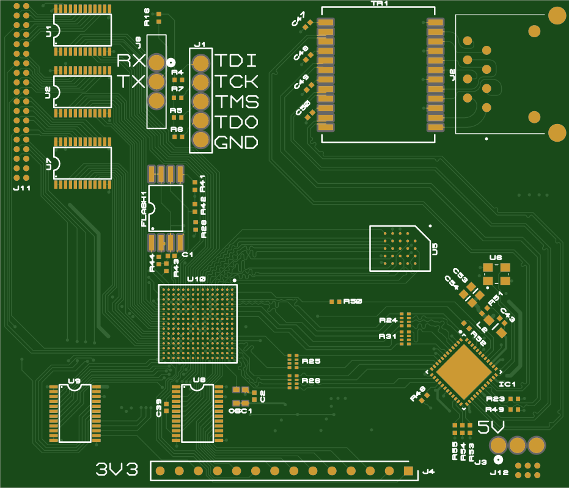

# efinix_titanium_control_card
Proteus Schematics and gerbers for 4 layer efinix titanium Ti60F225 control card. Card features a 512Mbit hyperbus dram memory, gigabit ethernet, 14bit/2.5Msps sar adc and lcd driver header. Card has been tested and programmed using ft4232H minimodule

Gerbers can be viewed by uploading the zip file to
https://www.gerberviewer.io

The project can be viewed with a free trial version of Proteus
https://www.labcenter.com/free-trial/

  </a>

  </a>

  </a>

